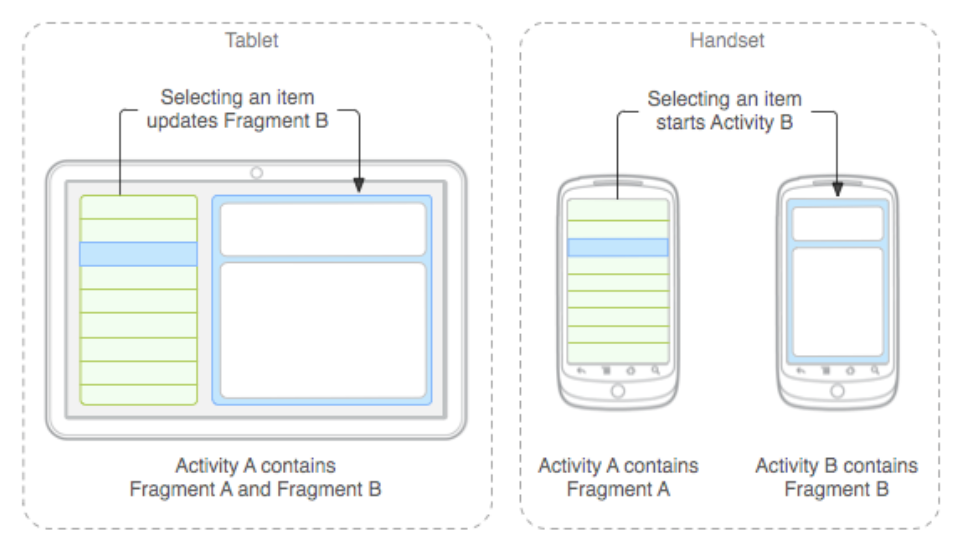
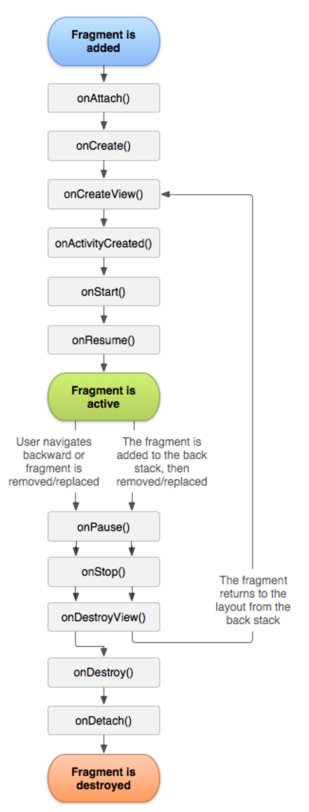
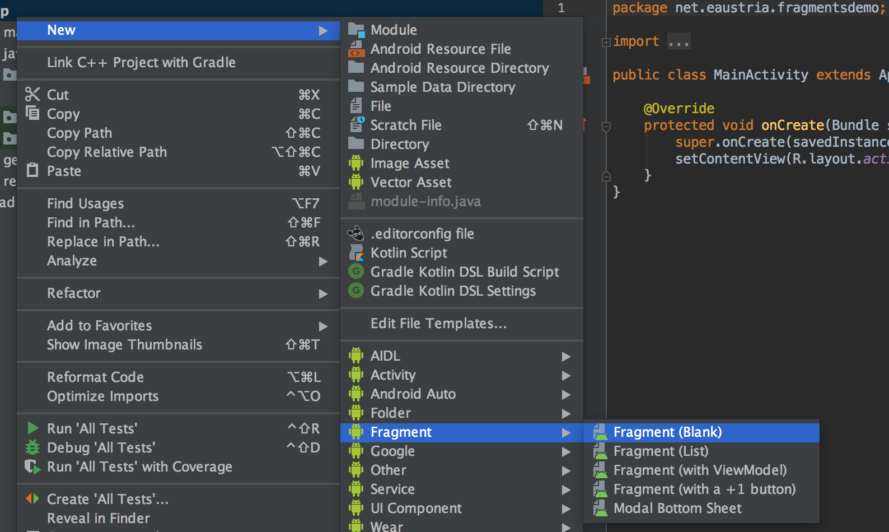
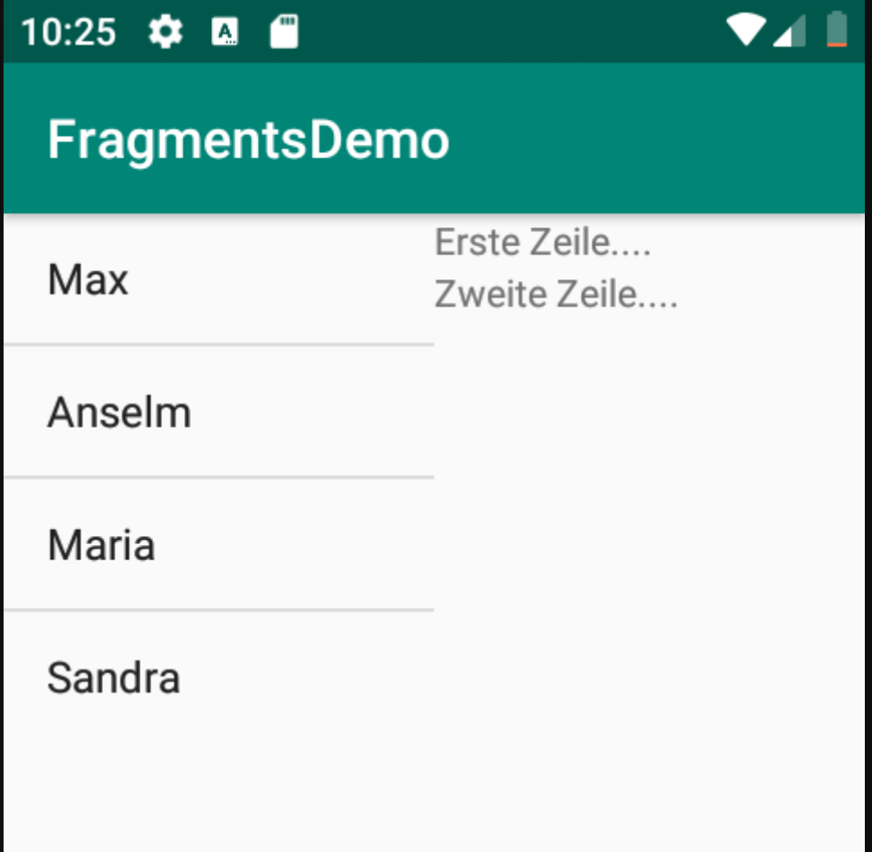
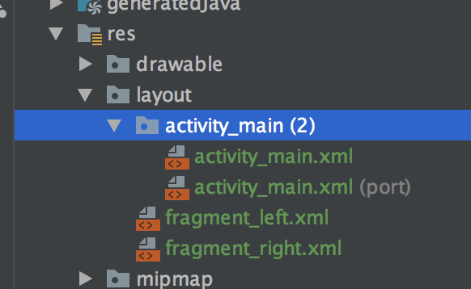
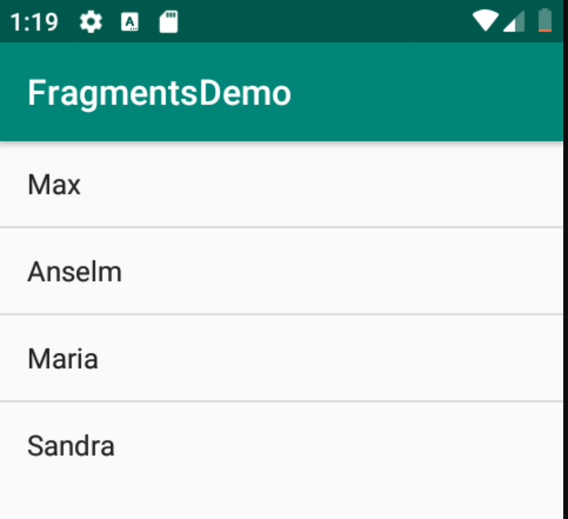
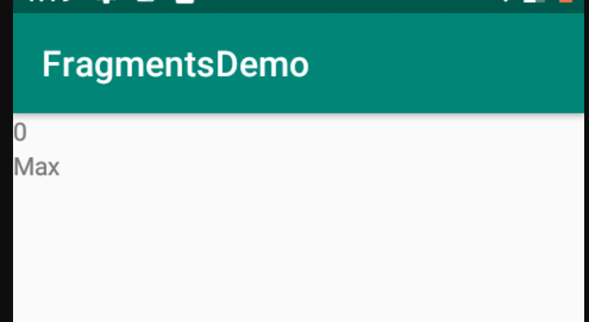
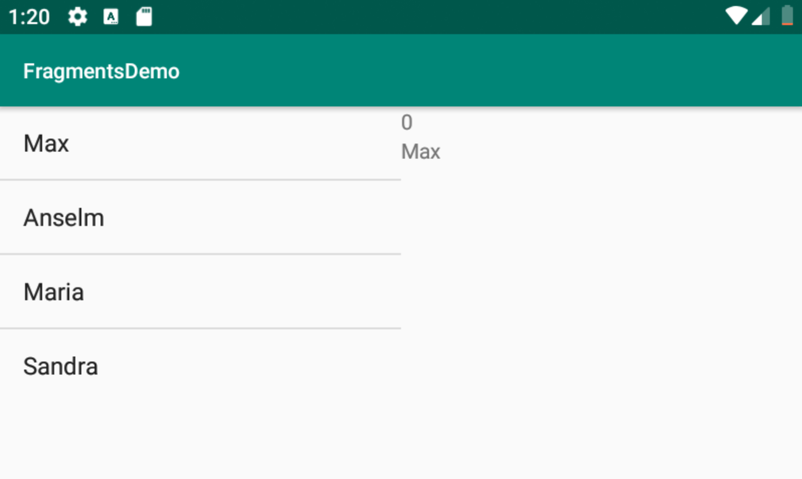

# Fragments

Die bislang genutzte kleinste "UI-Einheit" war die Activity. Eine Activity betrifft genau eine UI-Aufgabe. Für kleinere Displays ist diese Einteilung auch akzeptabel - auf größeren Displays, wie etwa Tablets entsteht so jedoch sehr schnell _Leerraum_ auf dem Bildschirm.

Um den zur Verfügung stehenden Platz besser und effizienter nutzen zu können, steht in Android das Konzept der Fragments zur Verfügung. Fragments sind eigenständige Komponenten, die innerhalb einer Activity verwendet werden können. So kann der Platz auf größeren Displays besser genutzt werden.

Ein Beispiel dafür ist eine typische _Master-Detail-Ansicht_ in der sowohl eine Übersicht, wie auch eine Detailansicht des jeweils ausgewählten Eintrags zur Verfügung stehen. Mithilfe von Activities könnte diese Struktur nur über zwei eigenständige Activities gelöst werden. Wie wir später sehen werden, ist das Konzept der Fragments jedoch so flexibel, dass je nach Größe des aktuellen Displays unterschiedliche Darstellungsvarianten automatisch gewählt werden.



## Lebenszyklus von Fragments
Ein Fragment ist immer an eine Activity gebunden. D.h. ein Fragment kann nie für sich alleine existieren. Damit ist das natürlich _Lebensende_ des Fragments auf jeden Fall mit dem _Lebensende_ der zugehörigen Activity verbunden.

Auch die entsprechenden Lebenszyklus-Methoden eines Fragments gleichen jenen einer Activity:



**Spezielle Fragment-Lebenszyklus Methoden:**

- **`onAttach()`:**
Das Fragment wird an die Activity gebunden wird.
- **`onCreateView()`:**
Das graphische UI vom Fragment wird in dieser Methode erzeugt. Mit dem übergebenen `LayoutInflater` wird aus einem XML-Layout File in dieser Methode das UI erzeugt.
- **`onActivityCreated()`:**
Die zugehörige Activity wurde vollständig erzeugt und geladen.
- **`onStart()`:**
Das Fragment ist in der gebundenen Activity bereits vollständig sichtbar.

Link zur Android Developer Doku: https://developer.android.com/guide/components/fragments.html

## Klassen für die Erzeugung von Fragments
Auch Fragments können in Android Studio ähnlich einfach wie Activities erzeugt werden:



In weiterer Folge wollen wir zwei Fragments erzeugen. Ein linkes Fragment, das eine Liste enthält und ein weiteres Fragment für die Detailansicht.

### LeftFragment / RightFragment Layouts

Layouts der beiden Fragments:
**LeftFragment:**
```xml
<?xml version="1.0" encoding="utf-8"?>
<FrameLayout xmlns:android="http://schemas.android.com/apk/res/android"
    xmlns:tools="http://schemas.android.com/tools"
    android:layout_width="match_parent"
    android:layout_height="match_parent"
    tools:context=".LeftFragment">

    <ListView
        android:id="@+id/listview"
        android:layout_width="wrap_content"
        android:layout_height="wrap_content"></ListView>

</FrameLayout>
```
**RightFragment:**
```xml
<?xml version="1.0" encoding="utf-8"?>
<LinearLayout xmlns:android="http://schemas.android.com/apk/res/android"
    xmlns:tools="http://schemas.android.com/tools"
    android:layout_width="match_parent"
    android:layout_height="match_parent"
    android:orientation="vertical"
    tools:context=".RightFragment">   
    <TextView
        android:id="@+id/txtview_1"
        android:layout_width="match_parent"
        android:layout_height="wrap_content"
        android:text="@string/hello_blank_fragment" />
    <TextView
        android:id="@+id/txtview_2"
        android:layout_width="match_parent"
        android:layout_height="wrap_content"
        android:text="@string/hello_blank_fragment" />
</LinearLayout>
```
### Code der Fragment-Klassen
Erzeugt man in Android Studio ein Fragment über das Menü, so wird sehr viel Code automatisch generiert, der nicht unmittelbar benötigt wird und den Zusammenhang für den Anfänger etwas erschwert. Aus diesem Grund wurde der Code entfernt und wird nach und nach manuell eingefügt.

**LeftFragment,java:**
```java
public class LeftFragment extends Fragment {
    private static final String TAG = LeftFragment.class.getSimpleName();
    private ListView list;
    private ArrayList<String> items = new ArrayList<>();

    @Override
    public View onCreateView(LayoutInflater inflater, ViewGroup container,
                             Bundle savedInstanceState) {
        Log.d(TAG, "onCreateView: entered");
        // Inflate the layout for this fragment
        View view = inflater.inflate(R.layout.fragment_left, container, false);
        initializeViews(view);
        return view;
    }

    private void initializeViews(View view) {
        Log.d(TAG, "initializeViews: entered");
        list = view.findViewById(R.id.listview);
        items.add("Max");
        items.add("Anselm");
        items.add("Maria");
        items.add("Sandra");
    }

    @Override
    public void onStart() {
        Log.d(TAG, "onStart: entered");
        super.onStart();
        final ArrayAdapter<String> adapter =
                new ArrayAdapter<>(
                        getActivity(),
                        android.R.layout.simple_list_item_1,
                        items
                );
        list.setAdapter(adapter);
    }
}
```

**RightFragment:**
```java
public class RightFragment extends Fragment {
    public final static String TAG = RightFragment.class.getSimpleName();
    private TextView txt1;
    private TextView txt2;

    @Override
    public View onCreateView(LayoutInflater inflater, ViewGroup container,
                             Bundle savedInstanceState) {
        Log.d(TAG, "onCreateView: entered");
        // Inflate the layout for this fragment
        View view = inflater.inflate(R.layout.fragment_right, container, false);
        intializeViews(view);
        return view;
    }
    private void intializeViews(View view) {
        Log.d(TAG, "intializeViews: entered");
        txt1 = view.findViewById(R.id.txtview_1);
        txt2 = view.findViewById(R.id.txtview_2);
        txt1.setText("Erste Zeile....");
        txt2.setText("Zweite Zeile....");
    }
    @Override
    public void onStart() {
        super.onStart();
        Log.d(TAG, "onStart: entered");
    }
}
```
### Fragments im Layout der MainActivity
Nun müssen die beiden Fragments in das Layout der MainActivity integriert werden. Dabei ist es einfacher, wenn die Klassen der Fragments bereits existieren. Dann können diese einfach in das Layout der MainActivity integriert werden:

```xml
<?xml version="1.0" encoding="utf-8"?>
<LinearLayout xmlns:android="http://schemas.android.com/apk/res/android"
    xmlns:tools="http://schemas.android.com/tools"
    android:layout_width="match_parent"
    android:layout_height="match_parent"
    android:orientation="horizontal"
    tools:context=".MainActivity">
    <fragment
        android:layout_width="0dp"
        android:layout_height="match_parent"
        android:layout_weight="1"
        android:id="@+id/fragLeft"
        android:name="net.eaustria.fragmentsdemo.LeftFragment"/>
    <fragment
        android:layout_width="0dp"
        android:layout_height="match_parent"
        android:layout_weight="1"
        android:id="@+id/fragRight"
        android:name="net.eaustria.fragmentsdemo.RightFragment"/>
</LinearLayout>
```

Nun beinhaltet das Layout beide Fragments nebeneinander und sollte etwa so aussehen:



## Datenaustausch zwischen den Fragments
Momentan besteht noch keine Verknüpfung zwischen der Auswahl im linken Fragment und der Detailanzeige im rechten Fragment. Dies wird im nächsten Schritt geändert. Es soll der Einfachheit halber lediglich die Position des angeklickten Eintrags sowie dessen Text an das andere Fragment übergeben werden.

Dieses Verhalten wird in Android als Implementierung des Observer Patterns umgesetzt. Das Observer Pattern ist ein Software-Entwurfsmuster und besitzt allgemeine Gültigkeit (https://de.wikipedia.org/wiki/Beobachter_(Entwurfsmuster)).

### Anpassungen auslösendes Fragment
Wie üblich muss natürlich ein Listener auf die ListView gesetzt werden, damit auf die Auswahl eines Elements reagiert werden kann.

```java
private void initializeViews(View view) {
    Log.d(TAG, "initializeViews: entered");
    list = view.findViewById(R.id.listview);
    items.add("Max");
    items.add("Anselm");
    items.add("Maria");
    items.add("Sandra");
    list.setOnItemClickListener(
        (parent,  view1, position, id) -> itemSelected(position));
}
```
Weiters benötigen wir ein Interface über das wir den Aufruf weiterleiten können. Am leichtesten erfolgt dies mithilfe eines inneren Typs:

```java
public interface OnSelectionChangedListener {
    void onSelectionChanged( int pos, String item);
}
```
Wir speichern uns eine Referenz auf die Activity mithilfe eines Objekts vom Typ `OnSelectionChangedListener`. In der Methoden `onAttach` wird das Fragment an die Activity gebunden. In dieser Methode können wir die Activity als Listener für die "Klick-Events" registieren. Allerdings sollten wir prüfen, ob die Activity auch tatsächlich das Interface implementiert.

```java
@Override
public void onAttach(Context context) {
   Log.d(TAG, "onAttach: entered");
   super.onAttach(context);
   if (context instanceof OnSelectionChangedListener) {
       listener = (OnSelectionChangedListener) context;
   } else {
       Log.d(TAG, "onAttach: Activity does not implement OnSelectionChangedListener");
   }
}
```
Nun kann der Click-Event über das Listener-Objekt weitergegeben werden:

```java
private void itemSelected(int position) {
   String item = items.get(position);
   listener.onSelectionChanged(position, item);
}
```
### Anpassungen Main-Activity
Die MainActivity dient in dieser Konstellation als Vermittler zwischen den beiden Fragments und wird mithilfe des Interface gesteuert. Aus diesem Grund muss sich die Activity einerseits als  Listener beim sendenden Fragment (linkes Fragment) registrieren und andererseits benötigt die Activity eine Referenz auf das empfangende Fragment. Diese Referenz erhält sie über den FragmentManager.

```java
public class MainActivity extends AppCompatActivity  
    implements  LeftFragment.OnSelectionChangedListener{

    private static final String TAG = MainActivity.class.getSimpleName();
    private RightFragment rightFragment;
    private boolean showRight = false;

    @Override
    protected void onCreate(Bundle savedInstanceState) {
        super.onCreate(savedInstanceState);
        setContentView(R.layout.activity_main);
        initializeView();
    }

    private void initializeView() {
        Log.d(TAG, "initializeView: entered");
        rightFragment = (RightFragment) getSupportFragmentManager()
                .findFragmentById(R.id.fragRight);
        showRight = rightFragment != null && rightFragment.isInLayout();
    }

    @Override
    public void onSelectionChanged(int pos, String item) {
        if (showRight) rightFragment.show(pos, item);
    }
}
```
### Anpassungen im empfangenden Fragment
Das Fragment, das die Daten von einem anderen Fragment empfangen soll, muss entsprechende Setter-Methoden zu Verfügung stellen:

```java
public void show(int pos, String item) {
    Log.d(TAG, "show: entered");
    txt1.setText(""+pos);
    txt2.setText(item);
}
```

## Unterscheidung zwischen Hoch- und Querformat
Das aktuelle Layout teilt den gesamten Bildschirm einfach in zwei Spalten - in der linken wird die Liste und in der rechten die Detailansicht angezeigt. Oftmals reicht jedoch der Platz im Hochformat (Portrait-Mode) nicht für zwei Spalten aus und man möchte im Hochformat die Liste und die Detailansicht getrennt voneinander anzeigen. Im Querformat (Landscape-Mode) sollten die beideb Fragments jedoch nebeneinander dargestellt werden.

### Anpassungen an den Layouts
Wir benötigen nun zwei unterschiedliche Layouts für Hoch- bzw. Querformat. Android verwaltet die Layout XML Dateien in unterschiedlichen Verzeichnissen und wählt das jeweils am besten passende aus. Möchten wir nun ein eigenes Layout für den Portrait-Mode erstellen, so muss dieses im Verzeichnis `layout-port` abgelegt werden.

Als erstes wählen wir `Layout resource file` als neue zu erstellende Android Ressource aus.


Wir verwenden den gleichen Namen des Layout Files der MainActivity (`activity_main`), als Ressourcen Typ wählen wir `Layout` und aus der Liste der Qualifier wählen wir `orientation` und setzen den Wert auf `Portrait`. Dies bedeutet, dass wir ein Layou File erstellen wollen, das nur verwendet wird, wenn sich die App im _Portrait-Mode_ befindet.



Nun sehen wir, dass im Ordner `activity_main` zwei Dateien enthalten sind. Bei einer steht die Anmerkung `(port)` - dies bedeutet, dass hier ein qualifier (nämlich die Ausrichtung des Bildschirms) zieht.

Wir fügen nun nur das linke Fragment in das Layout ein:

```xml
<?xml version="1.0" encoding="utf-8"?>
<LinearLayout
    xmlns:android="http://schemas.android.com/apk/res/android" android:layout_width="match_parent"
    android:layout_height="match_parent"
    android:orientation="vertical">
    <fragment
        android:layout_width="match_parent"
        android:layout_height="match_parent"
        android:id="@+id/fragLeft"
        android:name="net.eaustria.fragmentsdemo.LeftFragment" />
</LinearLayout>
```
### Neue Activity für Detailansicht

Die Detailansicht soll nun in einer eigenen Activity dargestellt werden. Erstellen wir dafür eine neue Activity:


Das Layout für diese neue Activity beinhaltet das rechte Fragment:

```xml
<?xml version="1.0" encoding="utf-8"?>
<LinearLayout xmlns:android="http://schemas.android.com/apk/res/android"    
    xmlns:tools="http://schemas.android.com/tools"
    android:layout_width="match_parent"
    android:layout_height="match_parent"
    tools:context=".RightActivity"
    android:orientation="vertical">
    <fragment
        android:layout_width="match_parent"
        android:layout_height="match_parent"
        android:id="@+id/fragRight"
        android:name="net.eaustria.fragmentsdemo.RightFragment" />
</LinearLayout>
```
**Wichtig:**
Da diese Acitivity nur im Portrait-Mode ausgeführt werden soll, überprüfen wir innerhalb der Methode `onCreate` ob sich das Gerät im entsprechenden Modus befindet. Ansonsten wird die Activity beendet. Die anzuzeigenden Daten erhält die Activity über den Intent. Dieser wird ausgepackt und an das `RightFragment`-Objekt mittels Aufruf der Methode `show` übergeben.

**Die Implementierung der Fragments selbst, bleibt komplett gleich!**

```java
public class RightActivity extends AppCompatActivity {
    private static final String TAG = RightActivity.class.getSimpleName();

    @Override
    protected void onCreate(Bundle savedInstanceState) {
        Log.d(TAG, "onCreate: entered");
        super.onCreate(savedInstanceState);
        setContentView(R.layout.activity_right);
        intializeViews();
        int orientation = getResources().getConfiguration().orientation;
        if (orientation != Configuration.ORIENTATION_PORTRAIT) {
            finish();
            return;
        }
        handleIntent();
    }

    private void handleIntent() {
        Log.d(TAG, "handleIntent: entered");
        Intent intent = getIntent();
        if (intent == null) return;
        RightFragment rightFragment = (RightFragment) getSupportFragmentManager()
                .findFragmentById(R.id.fragRight);
        int pos = intent.getIntExtra("pos", -1);
        String item = intent.getStringExtra("item");
        rightFragment.show(pos, item);
    }

    private void intializeViews() {
        ...
    }
}
```
In der MainActivity muss nun auch noch eine Anpassung durchgeführt werden: wir müssen unterscheiden, ob der Detailaufruf nur an das rechte Fragment delegiert werden muss oder ob eine neue Activity (die RightActivity) gestartet werden soll.

```java
@Override
public void onSelectionChanged(int pos, String item) {
   if (showRight) rightFragment.show(pos, item)
   else callRightActivity(pos, item);
}

private void callRightActivity(int pos, String item) {
   Log.d(TAG, "callRightActivity: entered");
   Intent intent = new Intent(this, RightActivity.class);
   intent.putExtra("pos", pos);
   intent.putExtra("item", item);
   startActivity(intent);
}
```
### Ergebnis der Anpassungen

Nun wird die Übersicht->Detailansicht im Querformat mit zwei Fragments, im Hochformat mit zwei hintereinander geschalteter Activities umgesetzt. Um die Darstellung im Emulator zu ändern, klickt man einfach auf das Icon zum Drehen der Ansicht.


#### Hochformat (Portrait Mode)



#### Querformat (Landscape Mode)

