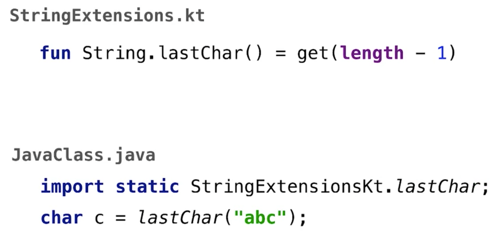
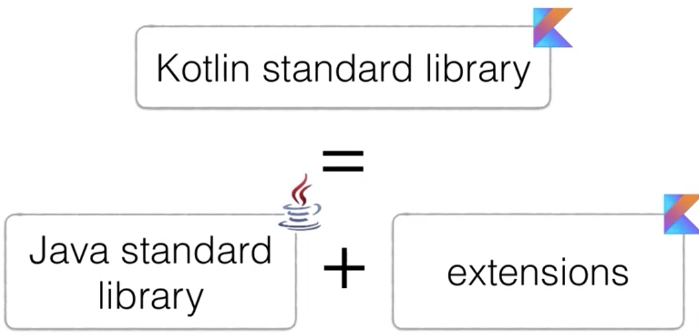

# Extension Functions
Mithilfe von Extension-Functions können Klassen in Kotlin erweitert werden. Dies ist ein Features von Kotlin, das in Java kein direktes Pendant hat.

```kotlin
fun String.lastChar() = this.get(this.length-1)
```
In obigem Beispiel definieren wir eine Erweiterungsfunktion für die Klasse `String`, welche wir in weiterer Folge wie ein ganz gewöhnliche Klassenfunktion verwenden können.
```kotlin
val c: Char = "abc".lastChar()
```
Jene Klasse, für die die Erweiterungsfunktion definiert wird, wird in Kotlin als _Receiver_ bezeichnet.

Um eine Erweiterungsfunktion nutzen zu können, muss diese explizit importiert werden oder es muss das gesamte Package, in welchem die Erweiterungsfunktion definiert wurd, importiert werden. Als Standard ist festegelegt, dass eine Erweiterungsfunktion nicht automatisch im gesamten Projekt zur Verfügung steht.

## Wie kann eine Erweiterungsfunktion aus Javacode heraus aufgerufen werden?

Jede Erweiterungsfunktion kann in Java, wie eine reguläre statische Funktion verwendet und aufgerufen werden.



**Beispiel:**

Wieviele Aufrufparameter hat diese Erweiterungsfunktion in Java?
* 1
* 2
* 3

```kotlin
fun String.repeat(n: Int): String {
    val sb = StringBuilder(n * length) for (i in 1..n) {
    sb.append(this)
}
return sb.toString()
}
```

_Die korrekte Antwort lautet: 2_

Wenn diese Erweiterungsfunktion in Bytecode transformiert wird, wird ein zweiter Parameter generiert, der den String selbst als Wert beinhaltet:

```java
StringUtilKt.repeat("abc", 3); //abcabcabc
```

## Verwendung von privaten Members einer Klasse innerhalb einer Erweiterungsfunktion
Können innerhalb einer Erweiterungsfunktion private Member-Variablen der Klasse verwendet werden?
```kotlin
fun String.lastChar() = get(length - 1)
```
_Die korrekte Antwort lautet: Nein._

Genauso wie bei allen anderen Methoden auch, können in Java nicht auf private-Member Variablen einer statischen Funktion einer anderen Klasse zugegriffen werden.

Erweiterungsfunktionen in Kotlin sind ganz gewöhnliche statuische Funktionen, die in einer eigenen Hilfsklasse definiert wurden. Aus diesem Grund können private Member einer Klasse nicht in Erweiterungsfunktionen verwendet werden.

## Beispiele für Erweiterungsfunktionen aus der Standardbibliothek
Erweiterungsfunktionen spielen in der Standardbibliothek von Kotlin ein tragenden Rollen. De Facto könnte man sagen, die Kotlin-Standardbibliothek ist die Java-Standardbibliothek, ergänzt mithilfe von Erweiterungsfunktionen.

Auf diese Weise wird eine bestmögliche Interoperabilität zwischen Java und Kotlin gewährleistet.

Beispiel _Collections_: Mithilfe von `javaClass` (bzw. `getClass()`) aus Java können wir prüfen, welche Typen aus den Kotlin Collection Typen im Bytecode generiert werden:
```Kotlin
val set = hashSetOf(1, 7, 9)
val list = arrayListOf(1, 7, 9)
val map = hashMapOf(1 to "one", 7 to "seven", 9 to "nine")
```
```java
println(set.javaClass);
println(list.javaClass);
println(map.javaClass);
```
**Ausgabe:***
```
class java.util.HashSet
class java.util.ArrayList
class java.util.HashMap
```
Wir sehen also, dass auch von Kotlin die Standard Java Typen verwendet werden. Die zusätzlichen Funktionen in Kotlin werden allesamt mithilfe von Erweiterungsfunktionen abgedeckt.

Beispielsweise die Funktion `getOrNull` ist eine Erweiterungsfunktion der Standardbibliothek aus Java. Aber auch die Funktion `withIndex()`, die über eine Liste iteriert und sowoh die einzelnen Elemente wie auch einen Index liefert stellt eine Erweiterungsfunktion dar.

Die Funktion `until` ist als Erweiterung mit `infix` definiert. Diese Definition erlaubt zwei verschiedene Anwendungsmöglichkeiten:
```kotlin
infix fun Int.until(to: Int): IntRange
```
1. **"Standardverwendung":** until(10)
1. **"Infix-Verwendung":** ... until 10

Ein weiteres Beispiel für eine Erweiterungsfunktion, die über die Infix Notation verwendet werden kann ist die Funktion `to`, die ein Aufzählungspaar zurückliefert. Beispiel:
```kotlin
infix fun <A, B> A.to(that: B) = Pair(this, that)

// "Klassisch"
0.to("zero")
// infix
0 to "zero"
```
So können insbesondere für MAP Datenstrukturen sehr einfach key-value Paare erzeugt werden:
```kotlin
mapOf(0 to "zero", 1 to "one")
```

## Erweiterungen der Klasse `String`
Natürlich verwendet Kotlin auch für String-Operationen die Java Bibiliothek als Basis. Doch auch diese wird über Erweiterungsfunktionen ausgebaut.
### Strings über mehrere Zeilen
In Kotlin kann mithilfe von `""" ... """` ein String deklariert werden, der über mehrere Zeilen geht. Die Zeilenumbrüche werden in den String mitaufgenommen.
```kotlin
val s = """This String
            contains
            three lines"""
```
In obigem Beispiel zählen auch die Leerzeichen in Zeile 2 und 3 des Strings als Elemente des Strings. Dieses Verhalten ist vielfach nicht gewünscht, da die Einrückungen nur der besseren Lesbarkeit vom Code dienen.

Um die führenden Leerzeichen nicht in den String mitaufzunehmen verwendet man die Funktionen `trimMargin` oder `trimIndent`:
```kotlin
val s = """This String
        |contains
        |three lines""".trimMargin()

// mit benutzerdefiniertem Randzeichen:
val s = """This String
        #contains
        #three lines""".trimMargin(marginPrefix='#')

// trimInden
val s = """This String
        contains
        three lines""".trimIndent()
```
### Regular Expression Strings
In Kotlin kann ein String einfach in einen regulären Ausdruck konvertiert werden. Danach kann über die Funktion `matches` geprüft werden, ob ein String mit dem regulären Ausdruck übereinstimmt.

```kotlin
val regex = "\\d{2}\\.\\d{2}\\.\\d{4}".toRegex()
regex.matches("07.12.2019") // => true
regex.matches("07.12.19") // => false
```

Eine angenehme Vereinfachung stellt hierbei die Verwendung von mehrzeiligen Strings dar. Denn innerhalb von Strings, die mittels `"""` definiert wurden, müssen Sonderzeichen nicht markiert werden:

```kotlin
val regex = """\d{2}\.\d{2}\.\d{4}""".toRegex()
regex.matches("07.12.2019") // => true
regex.matches("07.12.19") // => false
```
### Konvertierung von Strings in Zahlentypen

Mit den entsprechenden `toXY` Methoden können Strings in Zahlentypen umgewandelt werden. Auch diese sind als Erweiterungsfunktionen in Kotlin definiert.
```kotlin
"321".toInt()
"1e-10".toDouble()
```
Beinhaltet der String jedoch einen nicht interpretierbaren Inhalt, so wird eine `NumberFormatException` geworfen. Möchte man dies unterbinden, kann die Methode `toXYOrNull` verwendet werden:
```kotlin
"xy".toIntOrNull()  // => null
"321".toIntOrNull() // => 321
```

**Welchen Typ generiert dieser Ausdruck: `'a' to 1.0`**?
_Pair<Char, Double>_

## Erweiterungsfunktionen und Vererbung
Betrachten wir nun folgende Vererbungsstruktur:
```Kotlin
// open is "not final" in Java - it allows to override classes
// an open class in Kotlin is extensable
open class Parent
class Child: Paren()

fun Parent.foo() = "parent"
fun Child.foo() = "child"

fun main(args: Array<String>) {
    val parent: Parent = Child()
    println(parent.foo())
}
```
**Welche `foo`-Funktion wird in diesem Beispiel aufgerufen?**

_Es wird die parent-Foo Funktion aufgerufen!_

Extensions laufen in Kotlin ähnlich ab, wie statische Funktionen in Java. Man kann also obiges Beispiel genauso in Java mithilfe statischer Funktionen implementieren und die gleiche Frage beantworten.

```java
// Java:
public static String foo(Parent parent) { return "parent"; }
public static String foo(Child child) { return "child"; }

public static void main(String[] args) {
    Parent parent = new Child();
    System.out.println(foo(parent));
}
```
Statische Funktionen werden in Java statisch ausgewertet. Die entsprechende Funktion wird zur Compile-Zeit aufgrund des statischen Typs der Variablen ausgewählt.

_Extensions in Kotlin sind also im Grunde statische Java-Funktionen._

## Members versus Extensions
Was passiert, wenn wir in einer Erweiterung auf einen Klassen-Member zugreifen?
```kotlin
fun String.get(index: Int) = '*'
fun main(args: Array<String>) {
    println("abc".get(1))
}
```
_Die Ausgabe des Programmsnippets lautet: **"b"**_

In diesem Duell steht _Member_ immer über der Erweiterung. Da die Indizierung in Kotlin - genauso wie in Java - bei 0 beginnt, wird das Zeichen an der zweiten Position zurückgeliefert.

Sollte man versuchen, eine Erweiterung mit dem gleichen Namen eines bereits bestehenden Members einer Klasse zu definieren, liefert Kotlin eine Warnung: _Warning: Extension is shadowed by a member_.

Klassenmember können jedoch mittels Erweiterungen überladen werden. Beispiel:
```kotlin
class A {
    fun foo() = "member"
}
fun A.foo(i: Int) = "extension($i)"

A().foo(2) // extension(2)
```
Die Erweiterung wird dann ausgeführt, wenn der Typ besser passt.

## Zusammfassung Erweiterungen
Erweiterungen bzw. Extension stellen einen wesentlichen Teil der Sprachstruktur von Kotlin dar. Sie verfolgenden das Ziel, die API leichtgewichtig zu halten.

Auf diese Weise kann die Kernfunktionalität über Klassen und entsprechende Member / Methoden abgedeckt werden. Sämtliche Erweiterungen und Modifikationen, die die Bedienbarkeit erleichtern werden leichtgewichtig mittels Erweeiterungen implementiert.

Beispielsweise repräsentiert die Standardklasse `String` im Wesentlichen eine Abfolge von Zeichen, auf die über einen Index zugegriffen werden kann. Diese Funktionalität wird in der Kernklasse abgedeckt. Sämtliche weitere Funktionalität wie Konvertierung, RegularExpressions, etc. werden mittels Erweiterungen abgedeckt.
